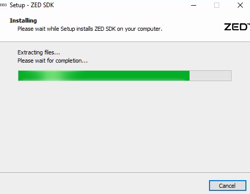
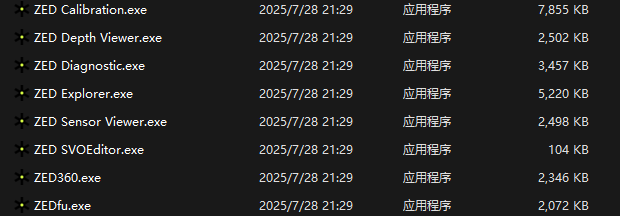

# ZED 相机配置

## 1. Windows 环境配置

### ZED-SDK 配置

1. 首先需要根据笔记本的显卡型号安装适配的显卡驱动，然后根据显卡驱动安装适配的 CUDA+cudnn。

2. 下载与电脑操作系统以及 CUDA 版本对应的 ZED-SDK。

   下载网址：[ZED SDK 5.0 - Download | Stereolabs](https://www.stereolabs.com/en-cn/developers/release)

3. 运行 ZED-SDK 安装程序：

   

   安装完成后，需要重启系统以更新 Windows 环境变量。

4. 重启后能够在 C 盘的 Program Files(x86) 文件夹中找到 ZED-SDK 文件夹，其中的 tools 包含了 ZED-SDK 中的各种工具，各种工具介绍见官方文档：[ZED Tools - Stereolabs --- ZED Tools - Stereolabs](https://www.stereolabs.com/docs/development/zed-tools)。

   

   > 运行 `ZED Diagnostic` 可以诊断环境是否配置好；运行 `ZED Explorer` 可以看到 ZED 双目传回的图像。

### pyZED 配置

pyZED 是使用 python 调用 ZED 的库。

> 前置条件：
>
> - ZED SDK 5.0 and its dependency CUDA；
> - Python 3.8+ x64
> - Cython >= 3.0.0
> - Numpy >= 2.0
> - OpenCV Python (optional)
> - PyOpenGL (optional)

在有上述环境后，运行 ZED SDK 文件夹内的 `get_python_api.py` 脚本安装 pyZED 库。

配置完成后，可以使用以下代码验证：

```python
import pyzed.sl as sl


def main():
    # Create a Camera object
    zed = sl.Camera()

    # Create a InitParameters object and set configuration parameters
    init_params = sl.InitParameters()
    init_params.sdk_verbose = 0

    # Open the camera
    err = zed.open(init_params)
    if err != sl.ERROR_CODE.SUCCESS:
        exit(1)

    # Get camera information (ZED serial number)
    zed_serial = zed.get_camera_information().serial_number
    print("Hello! This is my serial number: {0}".format(zed_serial))

    # Close the camera
    zed.close()


if __name__ == "__main__":
    main()
```

## 2. Ubuntu 环境配置

### ZED-SDK 配置

1. 首先需要安装适配的显卡驱动，然后根据显卡驱动安装适配的 CUDA+cudnn。

   使用 `nvidia-smi` 指令检查。

2. 安装 `zstd`：

   ```shell
   $ sudo apt install zstd
   ```

3. 运行安装程序

   ```shell
   $ chmod +x ZED_SDK_UbuntuXX_cudaYY.Y_vZ.Z.Z.zstd.run # 添加运行权限
   $ ./ZED_SDK_UbuntuXX_cudaYY.Y_vZ.Z.Z.zstd.run # 运行安装程序
   ```

   按 q 键表示阅读许可证。此后为正常安装流程。

4. ZED-SDK 5.0 安装时会把 `pyzed` 和相关 AI 模型一并安装。

5. 安装完可以在 `/usr/local/zed/tools` 中看到相关工具，可用诊断程序检查相关环境。

### ZED-ROS2-Wrapper 配置

[Github 地址](https://github.com/KumarRobotics/zed-ros2-wrapper?tab=readme-ov-file)

这是 ZED 相机集成到 ROS2 的功能包。

> 前置条件：
>
> - Ubuntu 20.04/22.04/24.04
> - ZED-SDK 5.0
> - ROS2 Foxy/Humble/Jazzy
> - CUDA

运行以下指令安装该功能包：

```shell
$ mkdir -p ~/ros2_ws/src/ # create your workspace if it does not exist
$ cd ~/ros2_ws/src/ #use your current ros2 workspace folder
$ git clone https://github.com/stereolabs/zed-ros2-wrapper.git
$ cd ..
$ sudo apt update
$ rosdep update
$ rosdep install --from-paths src --ignore-src -r -y # install dependencies
$ colcon build --symlink-install --cmake-args=-DCMAKE_BUILD_TYPE=Release --parallel-workers $(nproc) # build the workspace
$ echo source $(pwd)/install/local_setup.bash >> ~/.bashrc # automatically source the installation in every new bash (optional)
$ source ~/.bashrc
```

运行完成后可以进行配置检查：

```shell
$ ros2 launch zed_wrapper zed_camera.launch.py camera_model:=<camera_model> # <camera_model> 为相机类型
$ ros2 topic list # 查看话题
```

一般可以看到以下话题：

```shell
/zed/joint_states
/zed/plane
/zed/plane_marker
/zed/robot_description
/zed/zed_node/confidence/confidence_map
/zed/zed_node/depth/camera_info
/zed/zed_node/depth/depth_info
/zed/zed_node/depth/depth_registered
/zed/zed_node/depth/depth_registered/compressed
/zed/zed_node/depth/depth_registered/compressedDepth
/zed/zed_node/depth/depth_registered/ffmpeg
/zed/zed_node/depth/depth_registered/theora
/zed/zed_node/disparity/disparity_image
/zed/zed_node/left/camera_info
/zed/zed_node/left/image_rect_color
/zed/zed_node/left/image_rect_color/compressed
/zed/zed_node/left/image_rect_color/compressedDepth
/zed/zed_node/left/image_rect_color/ffmpeg
/zed/zed_node/left/image_rect_color/theora
/zed/zed_node/left_gray/camera_info
/zed/zed_node/left_gray/image_rect_gray
/zed/zed_node/left_gray/image_rect_gray/compressed
/zed/zed_node/left_gray/image_rect_gray/compressedDepth
/zed/zed_node/left_gray/image_rect_gray/ffmpeg
/zed/zed_node/left_gray/image_rect_gray/theora
/zed/zed_node/left_raw/camera_info
/zed/zed_node/left_raw/image_raw_color
/zed/zed_node/left_raw/image_raw_color/compressed
/zed/zed_node/left_raw/image_raw_color/compressedDepth
/zed/zed_node/left_raw/image_raw_color/ffmpeg
/zed/zed_node/left_raw/image_raw_color/theora
/zed/zed_node/left_raw_gray/camera_info
/zed/zed_node/left_raw_gray/image_raw_gray
/zed/zed_node/left_raw_gray/image_raw_gray/compressed
/zed/zed_node/left_raw_gray/image_raw_gray/compressedDepth
/zed/zed_node/left_raw_gray/image_raw_gray/ffmpeg
/zed/zed_node/left_raw_gray/image_raw_gray/theora
/zed/zed_node/odom
/zed/zed_node/path_map
/zed/zed_node/path_odom
/zed/zed_node/point_cloud/cloud_registered
/zed/zed_node/point_cloud/cloud_registered/draco
/zed/zed_node/point_cloud/cloud_registered/zlib
/zed/zed_node/point_cloud/cloud_registered/zstd
/zed/zed_node/pose
/zed/zed_node/pose/status
/zed/zed_node/pose_with_covariance
/zed/zed_node/rgb/camera_info
/zed/zed_node/rgb/image_rect_color
/zed/zed_node/rgb/image_rect_color/compressed
/zed/zed_node/rgb/image_rect_color/compressedDepth
/zed/zed_node/rgb/image_rect_color/ffmpeg
/zed/zed_node/rgb/image_rect_color/theora
/zed/zed_node/rgb_gray/camera_info
/zed/zed_node/rgb_gray/image_rect_gray
/zed/zed_node/rgb_gray/image_rect_gray/compressed
/zed/zed_node/rgb_gray/image_rect_gray/compressedDepth
/zed/zed_node/rgb_gray/image_rect_gray/ffmpeg
/zed/zed_node/rgb_gray/image_rect_gray/theora
/zed/zed_node/rgb_raw/camera_info
/zed/zed_node/rgb_raw/image_raw_color
/zed/zed_node/rgb_raw/image_raw_color/compressed
/zed/zed_node/rgb_raw/image_raw_color/compressedDepth
/zed/zed_node/rgb_raw/image_raw_color/ffmpeg
/zed/zed_node/rgb_raw/image_raw_color/theora
/zed/zed_node/rgb_raw_gray/camera_info
/zed/zed_node/rgb_raw_gray/image_raw_gray
/zed/zed_node/rgb_raw_gray/image_raw_gray/compressed
/zed/zed_node/rgb_raw_gray/image_raw_gray/compressedDepth
/zed/zed_node/rgb_raw_gray/image_raw_gray/ffmpeg
/zed/zed_node/rgb_raw_gray/image_raw_gray/theora
/zed/zed_node/right/camera_info
/zed/zed_node/right/image_rect_color
/zed/zed_node/right/image_rect_color/compressed
/zed/zed_node/right/image_rect_color/compressedDepth
/zed/zed_node/right/image_rect_color/ffmpeg
/zed/zed_node/right/image_rect_color/theora
/zed/zed_node/right_gray/camera_info
/zed/zed_node/right_gray/image_rect_gray
/zed/zed_node/right_gray/image_rect_gray/compressed
/zed/zed_node/right_gray/image_rect_gray/compressedDepth
/zed/zed_node/right_gray/image_rect_gray/ffmpeg
/zed/zed_node/right_gray/image_rect_gray/theora
/zed/zed_node/right_raw/camera_info
/zed/zed_node/right_raw/image_raw_color
/zed/zed_node/right_raw/image_raw_color/compressed
/zed/zed_node/right_raw/image_raw_color/compressedDepth
/zed/zed_node/right_raw/image_raw_color/ffmpeg
/zed/zed_node/right_raw/image_raw_color/theora
/zed/zed_node/right_raw_gray/camera_info
/zed/zed_node/right_raw_gray/image_raw_gray
/zed/zed_node/right_raw_gray/image_raw_gray/compressed
/zed/zed_node/right_raw_gray/image_raw_gray/compressedDepth
/zed/zed_node/right_raw_gray/image_raw_gray/ffmpeg
/zed/zed_node/right_raw_gray/image_raw_gray/theora
/zed/zed_node/status/health
/zed/zed_node/status/heartbeat
/zed/zed_node/stereo/image_rect_color
/zed/zed_node/stereo/image_rect_color/compressed
/zed/zed_node/stereo/image_rect_color/compressedDepth
/zed/zed_node/stereo/image_rect_color/ffmpeg
/zed/zed_node/stereo/image_rect_color/theora
/zed/zed_node/stereo_raw/image_raw_color
/zed/zed_node/stereo_raw/image_raw_color/compressed
/zed/zed_node/stereo_raw/image_raw_color/compressedDepth
/zed/zed_node/stereo_raw/image_raw_color/ffmpeg
/zed/zed_node/stereo_raw/image_raw_color/theora
```

配置完成。


