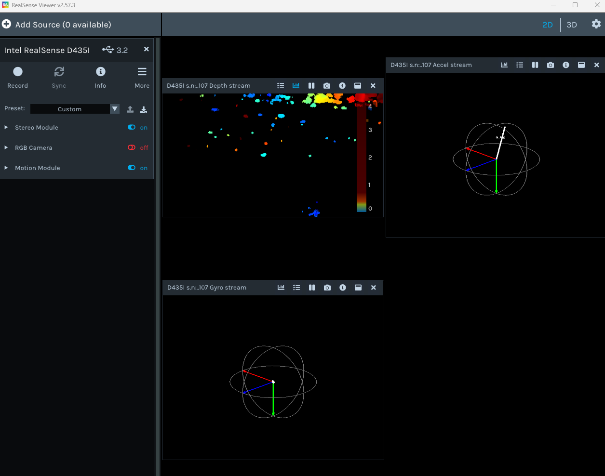

# Realsense D435i 相机配置

## 1. Windows 环境配置

### 安装 Realsense SDK

下载网址：[SDK 2.0 - RealSense](https://realsenseai.com/developers/sdk-2/?q=/developers/sdk-2&)

直接安装 `RealSense.SDK-WIN10-xxx.exe` 即可。

此时可以使用 Realsense Viewer 查看相机：



> 注意需要使用 USB 3.0 线连接相机和 PC 端。

### pyrealsense2 配置

使用以下命令配置即可：

```shell
$ pip install pyrealsense2
```

配置完成后，可以使用以下代码验证：

```python
# First import the library
import pyrealsense2 as rs

# Create a context object. This object owns the handles to all connected realsense devices
pipeline = rs.pipeline()
pipeline.start()

try:
    while True:
        # Create a pipeline object. This object configures the streaming camera and owns it's handle
        frames = pipeline.wait_for_frames()
        depth = frames.get_depth_frame()
        if not depth: continue

        # Print a simple text-based representation of the image, by breaking it into 10x20 pixel regions and approximating the coverage of pixels within one meter
        coverage = [0]*64
        for y in range(480):
            for x in range(640):
                dist = depth.get_distance(x, y)
                if 0 < dist and dist < 1:
                    coverage[x//10] += 1

            if y%20 == 19:
                line = ""
                for c in coverage:
                    line += " .:nhBXWW"[c//25]
                coverage = [0]*64
                print(line)

finally:
    pipeline.stop()
```

## 2. Ubuntu 环境配置

### 安装 Realsense SDK

1. 注册服务器公钥：

   ```shell
   sudo mkdir -p /etc/apt/keyrings
   curl -sSf https://librealsense.intel.com/Debian/librealsense.pgp | sudo tee /etc/apt/keyrings/librealsense.pgp > /dev/null
   ```

2. 确保安装了 apt HTTPS 支持：

   ```shell
   sudo apt-get install apt-transport-https
   ```

3. 将服务器添加到存储库列表：

   ```shell
   echo "deb [signed-by=/etc/apt/keyrings/librealsense.pgp] https://librealsense.intel.com/Debian/apt-repo `lsb_release -cs` main" | \
   sudo tee /etc/apt/sources.list.d/librealsense.list
   sudo apt-get update
   ```

4. 下载库：

   ```shell
   sudo apt-get install librealsense2-dkms
   sudo apt-get install librealsense2-utils
   # 可选的开发者工具
   sudo apt-get install librealsense2-dev
   sudo apt-get install librealsense2-dbg
   ```

5. 运行：

   ```shell
   realsense-viewer
   ```

### pyrealsense2 配置

和 Windows 配置同理，此处略。

### ROS2 配置

使用以下命令行即可：

```shell
sudo apt install ros-<ROS_DISTRO>-realsense2-*
```

